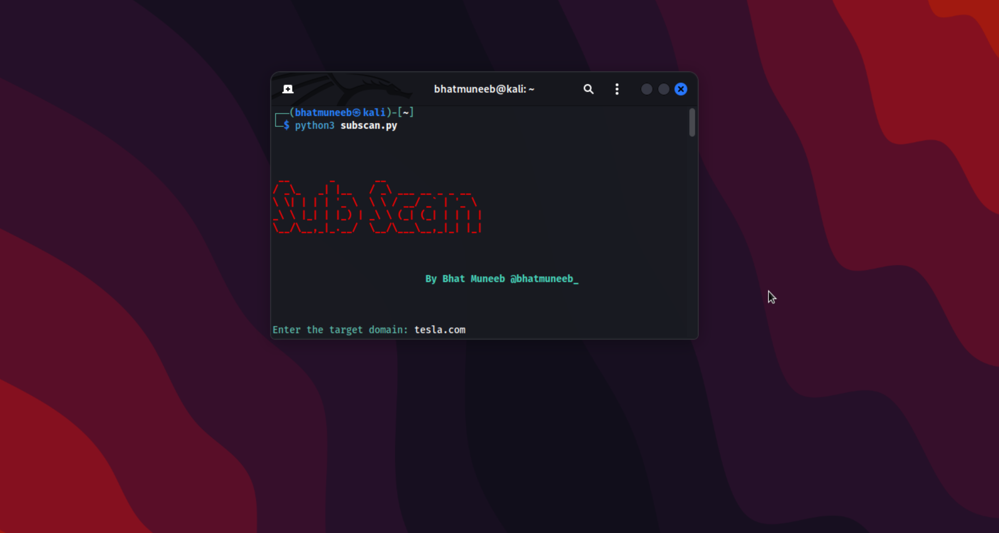
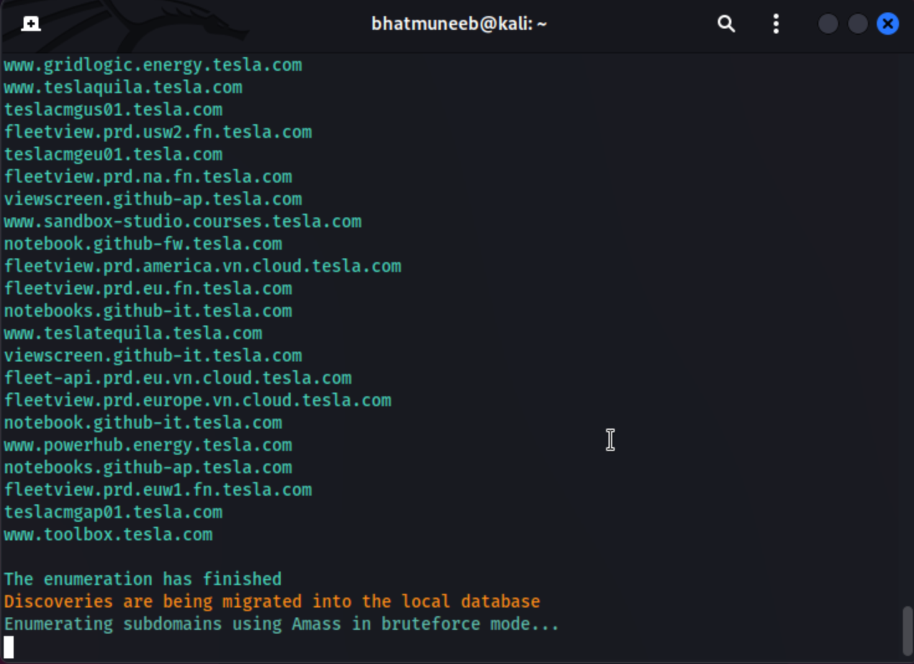

# Subscan

As an information security professional, the process of manually performing reconnaissance on a target domain to discover subdomains and check for subdomain takeover vulnerabilities can be a time-consuming and tedious task. That's why I decided to create this Subdomain Reconnaissance Tool to automate the process and make it more efficient.

This tool combines the power of multiple subdomain enumeration tools like Sublist3r, Assetfinder, Subfinder, and Amass, which helps in finding a comprehensive list of subdomains. Additionally, the tool checks for live subdomains using both httprobe and httpx, making sure that only the active subdomains are considered for the subdomain takeover check. The tool also checks for subdomain takeover vulnerabilities using three different tools, namely SubOver, Subzy and Subjack, which provides a thorough and reliable assessment of the target domain's security posture.

By creating this tool, I wanted to provide a quick and efficient way to perform reconnaissance on a target domain and help fellow security professionals save time and effort. This tool is not only user-friendly but also highly effective in discovering subdomains and potential subdomain takeover vulnerabilities. I hope this tool will be useful to the community.

.    


 


# Installation

1. Clone the Subscan repository to your local machine using the following command:

       ```git clone https://github.com/yourusername/subscan.git```

2. Change your current directory to the subscan folder:

       ```cd subscan```

3. Install the required dependencies by running the following command:

       ```pip install -r requirements.txt```

4. You're ready to use Subscan!

# Usage

1. Open a terminal and navigate to the Subscan folder.

2. Run the ```subscan.py``` file using the following command:

       ```python subscan.py```

3. Follow the on-screen prompts to enter the target domain and initiate the subdomain reconnaissance process.

4. After the process is complete, the results will be saved in a new folder with the name [target_domain]_output.

# Issues

If you encounter any issues while using Subscan, please create an issue in the GitHub repository.

# Disclaimer

Please use Subscan responsibly and only on domains that you have permission to scan. Subscan is intended for educational and ethical use only. The developers of Subscan are not responsible for any illegal or unethical use of this tool.

